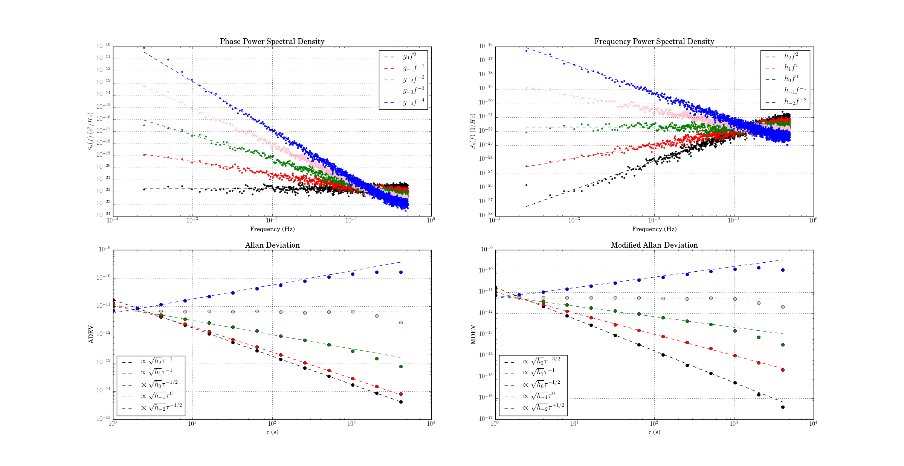

# colorednoise
Generate discrete colored (power law) noise

Python / numpy implementation of:
Kasdin, N.J., Walter, T., "Discrete simulation of power law noise 
[for oscillator stability evaluation]," Frequency Control Symposium, 
1992. 46th., Proceedings of the 1992 IEEE, pp.274, May 1992.
http://dx.doi.org/10.1109/FREQ.1992.270003

